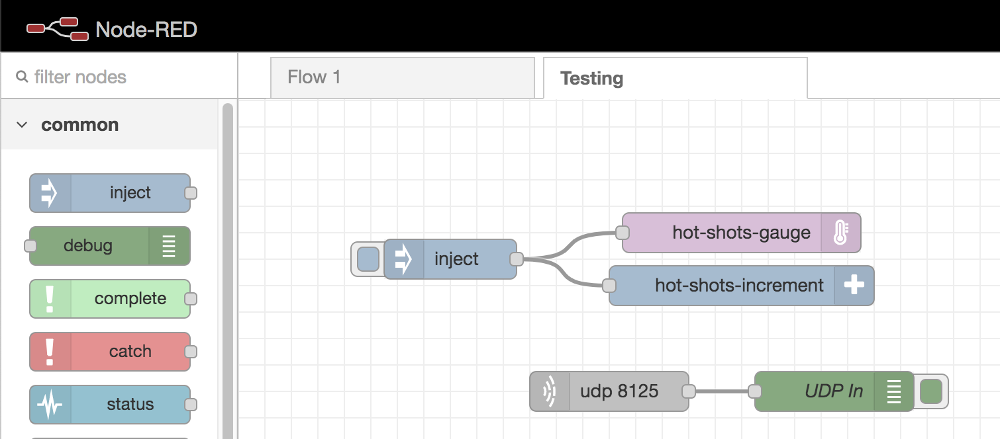

# node-red-contrib-hot-shots

Nodes that wrap hot-shots to provide methods to send statsd metrics from node-red.

# Development

To develop locally, install [Tilt](https://tilt.dev/)

Then run `tilt up`.

Any changes will sync into the container, you can then refresh the node-red interface.

## Test Flow

This flow starts a UDP server and wires up a gauge and an increment node so you can view the metrics streaming via the debug panel.



```json
[{"id":"f6f2187d.f17ca8","type":"tab","label":"Testing","disabled":false,"info":""},{"id":"ce6ab380.102ce","type":"inject","z":"f6f2187d.f17ca8","name":"","props":[{"p":"metric_name","v":"my_test_metric","vt":"str"},{"p":"metric_value","v":"4","vt":"num"},{"p":"metric_tags","v":"[\"k:v\"]","vt":"json"}],"repeat":"","crontab":"","once":false,"onceDelay":0.1,"topic":"","x":160,"y":520,"wires":[["2f1326c0.b1e7da","f649ea2e.69d4c8"]]},{"id":"2f1326c0.b1e7da","type":"hot-shots-gauge","z":"f6f2187d.f17ca8","name":"","server":"98c1009f.e5c4b","x":380,"y":500,"wires":[]},{"id":"f649ea2e.69d4c8","type":"hot-shots-increment","z":"f6f2187d.f17ca8","name":"","server":"98c1009f.e5c4b","x":380,"y":540,"wires":[]},{"id":"444adde.eb72d24","type":"udp in","z":"f6f2187d.f17ca8","name":"","iface":"","port":"8125","ipv":"udp4","multicast":"false","group":"","datatype":"utf8","x":280,"y":620,"wires":[["1808f5e8.717caa"]]},{"id":"1808f5e8.717caa","type":"debug","z":"f6f2187d.f17ca8","name":"UDP In","active":true,"tosidebar":true,"console":false,"tostatus":false,"complete":"true","targetType":"full","statusVal":"","statusType":"auto","x":450,"y":620,"wires":[]},{"id":"98c1009f.e5c4b","type":"hot-shots-statsd-client","host":"127.0.0.1","port":"8125"}]
```
